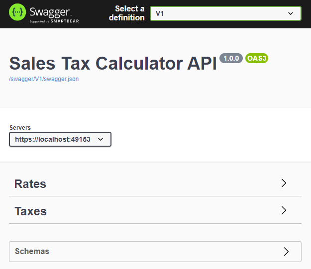
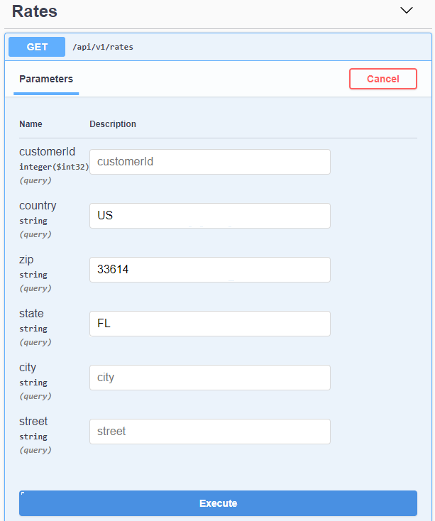
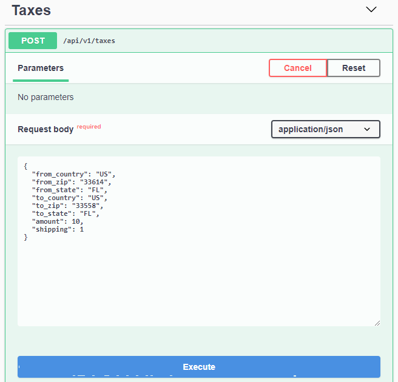

# Sales Tax Calculator
This project is a demonstration of a .Net Core WebAPI that calls the  [TaxJar](https://developers.taxjar.com/api/reference/) tax calculation service to get tax rates and calculate taxes on an order. The fictional requirements include the ability to use other tax services based on customer preferences.

The overall solution setup is based on a [Clean Architecture](https://blog.cleancoder.com/uncle-bob/2012/08/13/the-clean-architecture.html) design and demonstrates the following features:

* ASP.NET Core 5.0 WebAPI
* CQRS (Command Query Responsibility Segregation)
* [MediatR](https://github.com/jbogard/MediatR)
* Global Error Handling Middleware
* API Versioning
* Swagger UI
* Repository Pattern
* Fluent Validation
* Unit and Integration Tests

## Service Usage Instructions
Once the Sales Tax Calculator service is deployed or is running using Visual Studio, it can be called using the auto-generated Swagger UI or by a tool such as Postman. 
_(Note: An API Key must be obtained from TaxJar and placed in the appsettings.json file for the calls to be successful)_

The Swagger UI will produce a page produce a page similar to this:

### Rates

To get the rates for a locality, open the Rates section and click on the button that says "Try it out". Enter the desired parameters and press the Execute button.

The Customer ID is optional, but if it is supplied it must be a value of 1 - 5. Any other values will return an error. The Country and Zip values are required. All other values are optional.

### Taxes

To get the taxes for an order, open the Taxes section and click on the button that says "Try it out". Since the taxes uses a Post instead of a Get, the parameters must provided as a json string in the request body section:

The Customer ID is optional, but if it is supplied it must be a value of 1 - 5. Any other values will return an error. The To Country is required. The Zip is required when the Country is "US". The To State is required when the Country is "US" or "CA".

Additional information on the parameters and responses can be found in the [TaxJar API documentation](https://developers.taxjar.com/api/reference/#taxes)